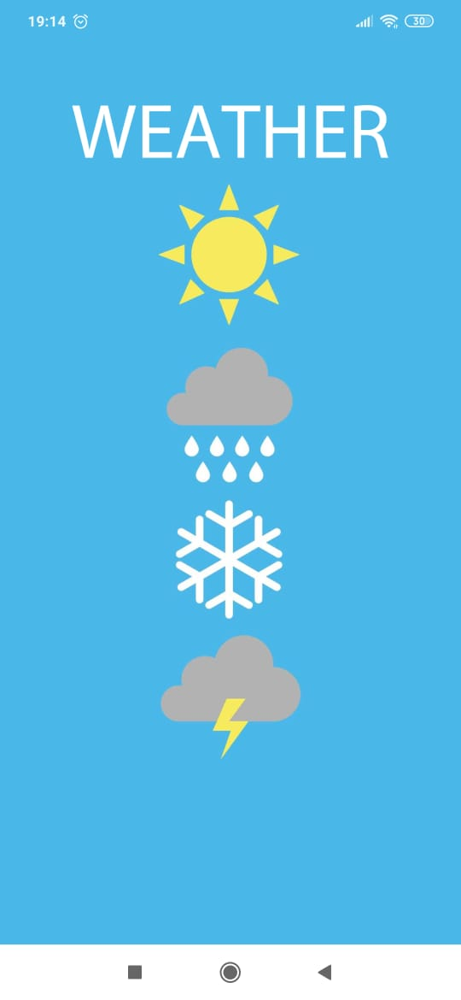
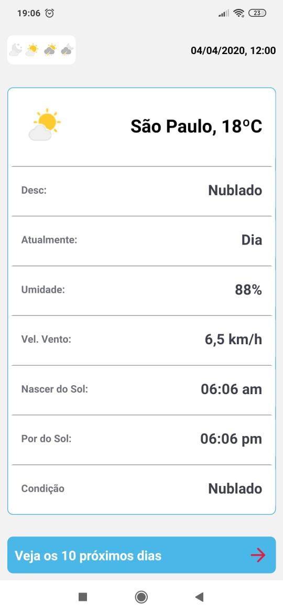
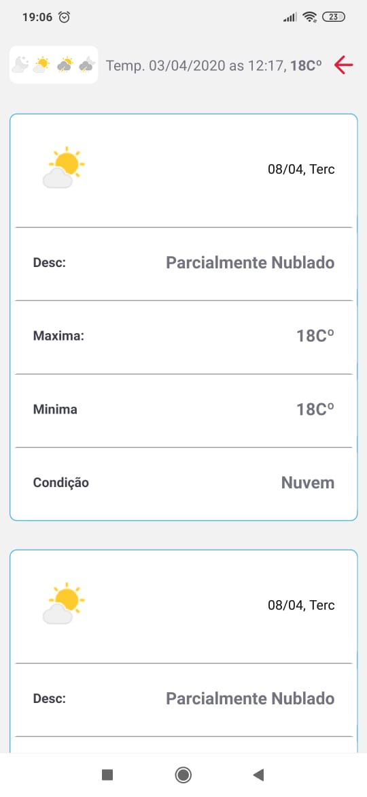

# *WEATHER*

# Intuito do App

É um App simples, que consome a API de previsão do Tempo da cidade de São Paulo.

Aplicativo desenvolvido em React Native Expo

# Dependências usadas:
        @expo/vector-icons
        @react-native-community/masked-view
        @react-navigation/native
        @react-navigation/stack
        axios
        expo-constants

    
[Link da API] (https://api.hgbrasil.com/weather)

# Alguns ScreenShot do App

* *Tela de Abertura*

* *Tela Principal*

* *Tela onde mostra a previsão do Tempo dos 9 próximos dias*

